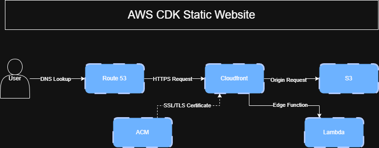

# Static Website CDK Project

A fully serverless static website deployed on AWS using the Cloud Development Kit (CDK). The stack provisions and connects S3, Lambda, and Route 53 to deliver a fast, scalable, and cost-efficient web presence.

## Architecture


```
User → Route 53 (DNS) → S3 (Static Hosting) → Lambda (Backend Logic)
```

- **Amazon S3** – Hosts the static website files (HTML, CSS, JS, assets)
- **AWS Lambda** – Handles any backend/serverless logic (e.g. form submissions, API calls)
- **Amazon Route 53** – Manages DNS and routes traffic to the S3 website endpoint
- **AWS CDK** – Defines and deploys all infrastructure as code (TypeScript/Python)

## Prerequisites

- [Node.js](https://nodejs.org/) (v18 or later)
- [AWS CLI](https://aws.amazon.com/cli/) configured with your credentials
- [AWS CDK](https://docs.aws.amazon.com/cdk/latest/guide/getting_started.html) installed globally

```bash
npm install -g aws-cdk
```

## Getting Started

### 1. Clone the repository

```bash
git clone https://github.com/YOUR_USERNAME/YOUR_REPO_NAME.git
cd YOUR_REPO_NAME
```

### 2. Install dependencies

```bash
npm install
```

### 3. Bootstrap your AWS environment (first time only)

```bash
cdk bootstrap
```

### 4. Deploy the stack

```bash
cdk deploy
```

## Useful CDK Commands

| Command | Description |
|---|---|
| `cdk synth` | Synthesize and print the CloudFormation template |
| `cdk diff` | Compare deployed stack with current state |
| `cdk deploy` | Deploy the stack to your AWS account |
| `cdk destroy` | Tear down the stack and all resources |

## Project Structure

```
├── bin/                  # CDK app entry point
├── lib/                  # Stack definition
├── lambda/               # Lambda function source code
├── website/              # Static website files (HTML, CSS, JS)
├── cdk.json              # CDK configuration
└── package.json
```

## Configuration

Update `cdk.json` or the stack file in `lib/` to configure:
- Your domain name (Route 53 hosted zone)
- S3 bucket name
- Lambda runtime and handler settings

## License

MIT
